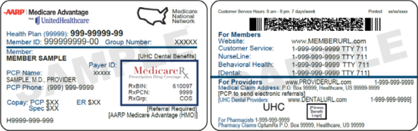
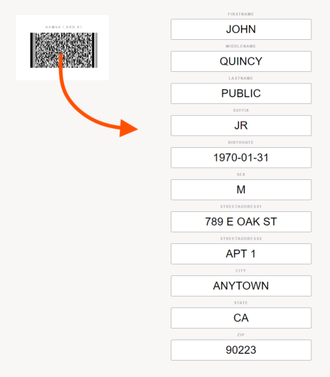

# Barcode Scanner for Electronic Medical Records

This solution offers a PDF417 bardcode scanner for quickly and accurately scanning the backs of Drivers Licenses and Health ID cards directly into web-based EMRs using inexpensive laser barcode scanners.  Scan events are easily captured to provide scanned details as Javascript objects.

It's a common need in the healthcare settings to enter patient demographics accurately and quickly.  This is often entered manually or by using a TWAIN scanner to capture the details from images of these ID cards.  However, using a document scanner is both slow and presents accuracy problems.  Document scanners experience mechanical malfunctions frequently and require more expensive models in order to sustain high volume usage.

This sample project includes the scan capture tooling as well as a test pages for validation purposes.

<p align="center"></p>
<p align="center"></p>

# Browser Scan Events

When barcodes are scanned, they inject the scanned data into the keyboard stream.  However, this data is not formatted in a way that is easily parsed.  Further, there are key events that cause strange behaviors to occur within the browser, such as opening up the "Downloads" dialog by injecting a `Ctrl+J` (which also represents a `line feed`).

To simplify the scanning process, this packge intercepts these scan events to translate them into subscribable `healthIdScan` or `aamvaIdScan` events.  When these events are triggered, you will receive a Javascript object that provides the details from the ID that are pertinent to healthcare settings.


```javascript
  import IdScanMonitor from "./id-scan-monitor";

  // activate passive listening to enable scan events
  IdScanMonitor.activateScanMonitor();

  // access values from scan event detail
  document.addEventListener("healthIdScan", (e) => {
    console.log(`healthIdScan: [${e.detail.toJson()}]`);
  });
  document.addEventListener("aamvaIdScan", (e) => {
    console.log(`aamvaIdScan: [${e.detail.toJson()}]`);
  });
```

Scan events capture fielded elements so that they can easily be bound to HTML forms:

<p align="center"></p>

# Health Identification Cards

Health ID Cards identify insurance and patient details to facilitate health care transactions and to provide input data for such transactions.  Very basic insurance and patient identification information is provided on all Health ID cards.  However, this information varies significantly depending on the payer with additional information being provided by various carriers.

Required fields on Health ID cards:

  * firstName
  * lastName
  * issuerId
  * cardholderId
  * cardType
## Example

**BCBS - Blue Cross Blue Shield**

```javascript
{
  "firstName":"MOSES",
  "lastName":"GARCIA",
  "middleName":"N",
  "cardType":"WH",
  "issuerId":"9118772604",
  "cardholderId":"960235001",
  "groupNumber":"8F9999",
  "issueDate":"2016-10-08",
  "rxBin":"610444",
  "rxPcn":"9999"
}
```

**UHC - United Healthcare**
```javascript
{
  "firstName":"JOSE",
  "lastName":"SMITH",
  "middleName":"MARCO",
  "birthDate":"1986-06-23",
  "cardType":"WH",
  "issuerId":"9101004444",
  "cardholderId":"ZGP923333171"
}
```


# AAMVA Identification Cards (aka Drivers Licenses)

Drivers Licenses and ID Cards produced in recent years comply with standards set forth by AAMVA to include quite a number of details about the card holder.  Virtually all demographic type fields are provided by the scan events.  However, not all values are extracted using this package since some details are not pertinent to the health care setting.

## Example

**Drivers License**

```javascript
{
  "firstName":"JOHN",
  "middleName":"QUINCY",
  "lastName":"PUBLIC",
  "suffix":"JR",
  "birthDate":"1970-01-31",
  "sex":"M",
  "issuerId":"636026",
  "cardType":"AAMVA-DL",
  "version":8,
  "race":"W",
  "ethnicity":"W",
  "eyeColor":"GRN",
  "hairColor":"BRO",
  "weight":"180 lb",
  "height":"069 in",
  "streetAddress1":"789 E OAK ST",
  "streetAddress2":"APT 1",
  "city":"ANYTOWN",
  "state":"CA",
  "zip":"90223",
  "country":"USA",
  "birthPlace":"OMAHA",
  "isDonor":true,
  "cardholderId":"1234567890"
}
```

---

## Getting Started

Install dependencies...

```bash
npm install
```

...then start

```bash
npm start
```

Navigate to [localhost:8080](http://localhost:8080) to use the local test application.


## Credits

This library heavily relies on [onScan.js](https://github.com/axenox/onscan.js) by Andrej Kabachnik.

## License

This is an open source project licensed under MIT.